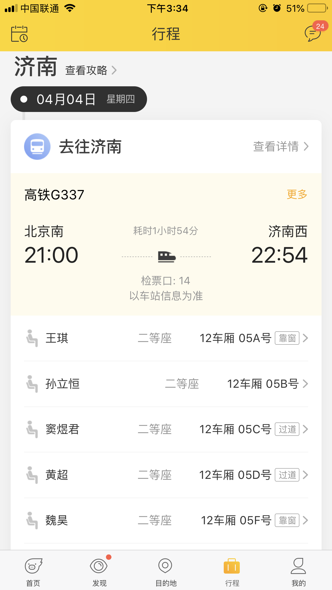
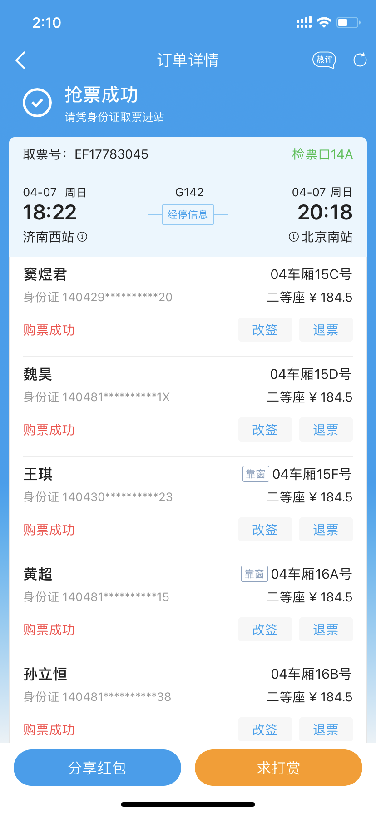

# 清明行
## Basic
- __时间__：2019年4月4日(晚) - 4月7日(晚)
- __地点__：济南、泰山

---
## traffic
### __北京 - 济南__
(4月4日 [北京南](https://www.amap.com/place/B000A83AJN "高德地图") 21:00 - 22:54)
<!--  -->
<html>
  
</html>

### __济南 - 北京__
(4月7日[济南西](https://www.amap.com/search?id=B02130TOED&city=370104&geoobj=116.295422%7C39.83793%7C116.625011%7C39.977245&query_type=IDQ&query=%E6%B5%8E%E5%8D%97%E8%A5%BF%E7%AB%99&zoom=12 "高德地图") 18:22 - 20:18)
<html>
  
</html>

---
## plan(1晚 + 3天)
- ### Day1 (4月4日 晚)

| Option | Description |
| ------ | ----------- |
| 入住    | 济南西附近民宿 |

- ### Day2 (4月5日)

| Option | Description                 |
| ------ | --------------------------- |
| 提车   | 早上8:00 去济南西附近提车       |
| 趵突泉  | 上午                         |   
| 大明湖  | 陛下，您还记得大明湖畔的夏雨荷吗？|
| 五龙潭  | 都是泉                        |
| 泰山民宿 | 晚从济南开车下榻泰山民宿        |

- ### Day3 (4月6日)

| Option | Description |
| ------ | ----------- |
| 泰山    | 早6点起床，吃饭 7点进入景区 |
| 泰安吃饭 | 吃饭去煎饼卷大葱店，在火车站附近的大润发对面(泰山炒鸡必点) |

- ### Day4 (4月7日)

| Option | Description |
| ------ | ----------- |
| 待定    | 岱庙？彩石溪  |
| 午饭    | 泰安         |
| 济南    | 1点驱车去济南西站 |
| 还车    | 3点在济南西站还车 |
| 回京    | 晚6:22开车      |

---

## Tip:
- [济南有哪些深藏不露的餐馆？](https://www.zhihu.com/question/24877105?utm_source=wechat_session&utm_medium=social&utm_oi=841402227557040128&from=groupmessage&isappinstalled=0 "知乎")

- [济南有哪些值得一去的餐馆，馆子里一定要尝试的菜式有哪些？](https://www.zhihu.com/question/48595265?utm_source=wechat_session&utm_medium=social&utm_oi=841402227557040128 "知乎")

- [泰山心得](https://www.zhihu.com/question/56997682/answer/151258760?utm_source=wechat_session&utm_medium=social&utm_oi=841402227557040128 "知乎")

## 待补充
1. 泰山下午出来，民宿及最后一天上午安排
2. 天气指数(携带衣服类型)
3. 一定要去吃哪些好吃的(见上)
4. 民宿信息
5. 消费统计

<html>

<html>
